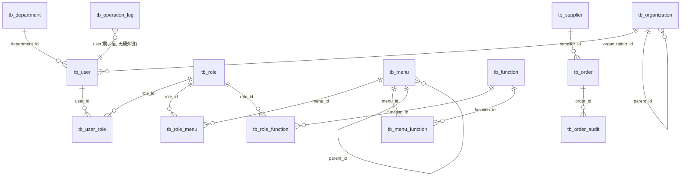

# 订单管理系统 数据库设计

> Phase 2 ③ 输出。以 `sql/init.sql`（权威当前 schema）为准，字段与约束逐一对齐；
> 架构层 13 表基线见 `docs/architecture/architecture.md`，本文档额外记录为日志持久化扩展的 `tb_operation_log`（共 14 张业务表）。

## 1. 概述

- **存储引擎**：SQLite 单文件数据库（如 `data/order-manage.db`），零独立服务进程，契合单机部署 NFR（对应 `openspec/specs/nonfunctional/spec.md` REQ-NFR-004）；备份即拷贝单文件。
- **初始化脚本**：`sql/init.sql`，幂等（`CREATE TABLE IF NOT EXISTS` / `CREATE INDEX IF NOT EXISTS`），含建表、索引与初始化数据。
- **命名约定**：
  - 表名统一 `tb_` 前缀；
  - 主键统一 `id`（`INTEGER PRIMARY KEY AUTOINCREMENT` 自增）；
  - 字段统一小写**下划线**命名；
  - 时间字段统一 `create_time` / `update_time`（`DATETIME DEFAULT CURRENT_TIMESTAMP`）。
- **与架构文档一致性**：13 表基线与 `docs/architecture/architecture.md` 第 9 节表清单一致；`tb_operation_log` 为在该基线之上为 `logs` spec 持久化新增的扩展表（见 §3.14）。
- **数据规模基准**：约 20000 条业务数据、约 50 并发下列表/报表查询 ≤ 2s（REQ-NFR-001/002/005），索引设计（§6）按列表筛选场景布置。
- **无外键约束**：SQLite 默认不启用 `FOREIGN KEY` 强制，表间引用完整性由 Service 层业务校验保证（如供应商被订单引用不可删、部门被用户引用不可删，见各 spec）。

## 2. 表清单

架构 13 表基线 + 1 张日志扩展表：

| # | 表名 | 用途（一句话） |
|---|---|---|
| 1 | `tb_user` | 用户账号（用户名、密码哈希、状态、所属部门/机构） |
| 2 | `tb_role` | 角色定义（内置管理员/审核员/普通用户三角色） |
| 3 | `tb_user_role` | 用户 ↔ 角色 多对多关联（RBAC） |
| 4 | `tb_department` | 部门主数据（初始化仅内置默认根部门） |
| 5 | `tb_organization` | 机构主数据（总行→二级支行 5 级树） |
| 6 | `tb_menu` | 导航菜单树（一级/二级菜单，权限载体之一） |
| 7 | `tb_function` | 按钮级功能权限（`域:操作` 权限标识） |
| 8 | `tb_menu_function` | 菜单 ↔ 功能 关联（功能挂载到唯一菜单） |
| 9 | `tb_role_menu` | 角色 ↔ 菜单 授权（控制侧边栏可见性） |
| 10 | `tb_role_function` | 角色 ↔ 功能 授权（控制按钮/接口级权限） |
| 11 | `tb_supplier` | 供应商主数据（启停用，订单引用） |
| 12 | `tb_order` | 订单业务数据（状态：待审核/已驳回/已完成） |
| 13 | `tb_order_audit` | 订单审核记录（审核人、结果、意见、时间） |
| 14 | `tb_operation_log` | 操作日志（扩展表：操作人/操作类型/操作目标/IP/时间） |

> 说明：`tb_order`、`tb_order_audit` 初始化无数据行，由业务运行产生；其余表初始化种子数据见 §7。

## 3. 每张表详细设计

### 3.1 tb_user — 用户账号

- **表名**：`tb_user`
- **用途**：存储系统登录账号与基础档案；密码仅存哈希，任何查询/展示不得返回明文（REQ-USER-005）。
- **字段**：

| 字段名 | 类型 | 约束 | 默认值 | 备注 |
|---|---|---|---|---|
| id | INTEGER | PRIMARY KEY AUTOINCREMENT | — | 主键 |
| username | VARCHAR(64) | NOT NULL UNIQUE | — | 用户名，全局唯一（REQ-USER-002） |
| password | VARCHAR(128) | NOT NULL | — | 密码哈希，不明文展示 |
| real_name | VARCHAR(64) | — | — | 姓名 |
| status | VARCHAR(8) | NOT NULL | '启用' | 启用 / 停用（§5） |
| department_id | INTEGER | — | — | 所属部门，引用 `tb_department.id` |
| organization_id | INTEGER | — | — | 所属机构，引用 `tb_organization.id` |
| first_login | INTEGER | NOT NULL | 0 | 是否首次登录，1=需强制改密（REQ-AUTH-007） |
| fail_count | INTEGER | NOT NULL | 0 | 连续密码错误次数，≥5 锁定（REQ-AUTH-003） |
| remark | VARCHAR(255) | — | — | 备注 |
| create_time | DATETIME | — | CURRENT_TIMESTAMP | 创建时间 |
| update_time | DATETIME | — | CURRENT_TIMESTAMP | 更新时间 |

- **主键**：`id`
- **唯一索引**：`username`（列级 UNIQUE）
- **普通索引**：`status`、`department_id`、`organization_id`（§6）
- **表间关系**：`department_id → tb_department.id`；`organization_id → tb_organization.id`；经 `tb_user_role` 关联角色。

### 3.2 tb_role — 角色

- **表名**：`tb_role`
- **用途**：定义 RBAC 角色；初始化内置 3 个角色，角色权限经 `tb_role_menu` / `tb_role_function` 分配。
- **字段**：

| 字段名 | 类型 | 约束 | 默认值 | 备注 |
|---|---|---|---|---|
| id | INTEGER | PRIMARY KEY AUTOINCREMENT | — | 主键 |
| code | VARCHAR(64) | NOT NULL UNIQUE | — | 角色编号，唯一（ROLE_ADMIN 等） |
| name | VARCHAR(64) | NOT NULL | — | 角色名称（管理员/审核员/普通用户） |
| remark | VARCHAR(255) | — | — | 备注 |
| create_time | DATETIME | — | CURRENT_TIMESTAMP | 创建时间 |
| update_time | DATETIME | — | CURRENT_TIMESTAMP | 更新时间 |

- **主键**：`id`
- **唯一索引**：`code`（列级 UNIQUE）
- **普通索引**：无（查询按主键/编号，编号已有唯一索引）
- **表间关系**：经 `tb_user_role`、`tb_role_menu`、`tb_role_function` 分别关联用户、菜单、功能。

### 3.3 tb_user_role — 用户-角色关联

- **表名**：`tb_user_role`
- **用途**：用户与角色的多对多关联表（RBAC 用户侧）。
- **字段**：

| 字段名 | 类型 | 约束 | 默认值 | 备注 |
|---|---|---|---|---|
| id | INTEGER | PRIMARY KEY AUTOINCREMENT | — | 主键 |
| user_id | INTEGER | NOT NULL | — | 引用 `tb_user.id` |
| role_id | INTEGER | NOT NULL | — | 引用 `tb_role.id` |
| create_time | DATETIME | — | CURRENT_TIMESTAMP | 创建时间 |
| update_time | DATETIME | — | CURRENT_TIMESTAMP | 更新时间 |

- **主键**：`id`
- **唯一索引**：无（如需防重复绑定可在 Service 层校验）
- **普通索引**：`user_id`、`role_id`（§6）
- **表间关系**：`user_id → tb_user.id`；`role_id → tb_role.id`。

### 3.4 tb_department — 部门

- **表名**：`tb_department`
- **用途**：用户所属部门主数据；初始化仅内置 1 条默认根部门（DEPT-000 总部），业务部门运行时创建（REQ-DEPT-005）。
- **字段**：

| 字段名 | 类型 | 约束 | 默认值 | 备注 |
|---|---|---|---|---|
| id | INTEGER | PRIMARY KEY AUTOINCREMENT | — | 主键 |
| code | VARCHAR(64) | NOT NULL UNIQUE | — | 部门编号，全局唯一 |
| name | VARCHAR(64) | NOT NULL | — | 部门名称 |
| remark | VARCHAR(255) | — | — | 备注 |
| create_time | DATETIME | — | CURRENT_TIMESTAMP | 创建时间 |
| update_time | DATETIME | — | CURRENT_TIMESTAMP | 更新时间 |

- **主键**：`id`
- **唯一索引**：`code`（列级 UNIQUE）
- **普通索引**：无
- **表间关系**：被 `tb_user.department_id` 引用；被引用的部门不可删除（REQ-DEPT-004）。

### 3.5 tb_organization — 机构（5 级树）

- **表名**：`tb_organization`
- **用途**：5 级树形机构主数据（总行/一级分行/二级分行/一级支行/二级支行），供用户管理引用。
- **字段**：

| 字段名 | 类型 | 约束 | 默认值 | 备注 |
|---|---|---|---|---|
| id | INTEGER | PRIMARY KEY AUTOINCREMENT | — | 主键 |
| code | VARCHAR(64) | NOT NULL UNIQUE | — | 机构编号，全局唯一、仅字母数字、不可改（REQ-ORG-002/004） |
| name | VARCHAR(64) | NOT NULL | — | 机构名称 |
| short_name | VARCHAR(64) | — | — | 机构简称 |
| level | VARCHAR(16) | NOT NULL | — | 层级：hq/branch1/branch2/sub1/sub2（§5） |
| parent_id | INTEGER | — | NULL | 上级机构，自引用 `tb_organization.id`；顶级为 NULL |
| contact | VARCHAR(64) | — | — | 联系人 |
| phone | VARCHAR(32) | — | — | 联系电话 |
| region | VARCHAR(128) | — | — | 所在地区 |
| address | VARCHAR(255) | — | — | 详细地址 |
| remark | VARCHAR(255) | — | — | 备注 |
| create_time | DATETIME | — | CURRENT_TIMESTAMP | 创建时间 |
| update_time | DATETIME | — | CURRENT_TIMESTAMP | 更新时间 |

- **主键**：`id`
- **唯一索引**：`code`（列级 UNIQUE）
- **普通索引**：`parent_id`、`level`（§6）
- **表间关系**：`parent_id` 自引用形成树；被 `tb_user.organization_id` 引用；存在下级的机构不可删除（REQ-ORG-005）。

### 3.6 tb_menu — 菜单（树）

- **表名**：`tb_menu`
- **用途**：导航菜单树（一级/二级），角色可见性的权限载体；固定 6 个一级 + 11 个二级（REQ-MENU-006）。
- **字段**：

| 字段名 | 类型 | 约束 | 默认值 | 备注 |
|---|---|---|---|---|
| id | INTEGER | PRIMARY KEY AUTOINCREMENT | — | 主键 |
| code | VARCHAR(64) | NOT NULL UNIQUE | — | 菜单编号，全局唯一、不可改 |
| name | VARCHAR(64) | NOT NULL | — | 菜单名称 |
| parent_id | INTEGER | — | NULL | 上级菜单，自引用 `tb_menu.id`；一级菜单为 NULL |
| route | VARCHAR(128) | — | — | 路由；目录类一级可为空，二级页面类必填 |
| menu_type | VARCHAR(8) | NOT NULL | — | level1 / level2（§5） |
| sort | INTEGER | — | 0 | 排序号 |
| remark | VARCHAR(255) | — | — | 备注 |
| create_time | DATETIME | — | CURRENT_TIMESTAMP | 创建时间 |
| update_time | DATETIME | — | CURRENT_TIMESTAMP | 更新时间 |

- **主键**：`id`
- **唯一索引**：`code`（列级 UNIQUE）
- **普通索引**：`parent_id`、`menu_type`（§6）
- **表间关系**：`parent_id` 自引用形成树；经 `tb_menu_function` 关联功能；经 `tb_role_menu` 被角色授权；存在子菜单的菜单不可删除（REQ-MENU-005）。

### 3.7 tb_function — 功能（按钮权限）

- **表名**：`tb_function`
- **用途**：按钮级功能权限最小单元，权限标识格式 `域:操作`（如 `order:query`）。
- **字段**：

| 字段名 | 类型 | 约束 | 默认值 | 备注 |
|---|---|---|---|---|
| id | INTEGER | PRIMARY KEY AUTOINCREMENT | — | 主键 |
| code | VARCHAR(64) | NOT NULL UNIQUE | — | 功能编号，由权限标识生成、唯一、不可改 |
| name | VARCHAR(64) | NOT NULL | — | 功能名称 |
| perm | VARCHAR(64) | NOT NULL UNIQUE | — | 权限标识 `域:操作`，全局唯一（§5） |
| remark | VARCHAR(255) | — | — | 备注 |
| create_time | DATETIME | — | CURRENT_TIMESTAMP | 创建时间 |
| update_time | DATETIME | — | CURRENT_TIMESTAMP | 更新时间 |

- **主键**：`id`
- **唯一索引**：`code`、`perm`（列级 UNIQUE）
- **普通索引**：无（perm 唯一索引已覆盖按标识查询）
- **表间关系**：经 `tb_menu_function` 挂载到唯一菜单；经 `tb_role_function` 被角色授权；删除功能须同步清理两表（REQ-FUNC-004）。

### 3.8 tb_menu_function — 菜单-功能关联

- **表名**：`tb_menu_function`
- **用途**：功能与菜单的挂载关系；每个功能挂且仅挂一个菜单（REQ-FUNC-005）。
- **字段**：

| 字段名 | 类型 | 约束 | 默认值 | 备注 |
|---|---|---|---|---|
| id | INTEGER | PRIMARY KEY AUTOINCREMENT | — | 主键 |
| menu_id | INTEGER | NOT NULL | — | 引用 `tb_menu.id` |
| function_id | INTEGER | NOT NULL | — | 引用 `tb_function.id` |
| create_time | DATETIME | — | CURRENT_TIMESTAMP | 创建时间 |
| update_time | DATETIME | — | CURRENT_TIMESTAMP | 更新时间 |

- **主键**：`id`
- **唯一索引**：无
- **普通索引**：`menu_id`、`function_id`（§6）
- **表间关系**：`menu_id → tb_menu.id`；`function_id → tb_function.id`。

### 3.9 tb_role_menu — 角色-菜单授权

- **表名**：`tb_role_menu`
- **用途**：角色对菜单的授权，控制侧边栏可见性；无权限菜单不展示（REQ-ROLE-006）。
- **字段**：

| 字段名 | 类型 | 约束 | 默认值 | 备注 |
|---|---|---|---|---|
| id | INTEGER | PRIMARY KEY AUTOINCREMENT | — | 主键 |
| role_id | INTEGER | NOT NULL | — | 引用 `tb_role.id` |
| menu_id | INTEGER | NOT NULL | — | 引用 `tb_menu.id` |
| create_time | DATETIME | — | CURRENT_TIMESTAMP | 创建时间 |
| update_time | DATETIME | — | CURRENT_TIMESTAMP | 更新时间 |

- **主键**：`id`
- **唯一索引**：无
- **普通索引**：`role_id`、`menu_id`（§6）
- **表间关系**：`role_id → tb_role.id`；`menu_id → tb_menu.id`。

### 3.10 tb_role_function — 角色-功能授权

- **表名**：`tb_role_function`
- **用途**：角色对功能的授权，控制按钮展示与接口级权限（`域:操作` 标识）。
- **字段**：

| 字段名 | 类型 | 约束 | 默认值 | 备注 |
|---|---|---|---|---|
| id | INTEGER | PRIMARY KEY AUTOINCREMENT | — | 主键 |
| role_id | INTEGER | NOT NULL | — | 引用 `tb_role.id` |
| function_id | INTEGER | NOT NULL | — | 引用 `tb_function.id` |
| create_time | DATETIME | — | CURRENT_TIMESTAMP | 创建时间 |
| update_time | DATETIME | — | CURRENT_TIMESTAMP | 更新时间 |

- **主键**：`id`
- **唯一索引**：无
- **普通索引**：`role_id`、`function_id`（§6）
- **表间关系**：`role_id → tb_role.id`；`function_id → tb_function.id`。

### 3.11 tb_supplier — 供应商

- **表名**：`tb_supplier`
- **用途**：订单可引用的供应商主数据，含启停用状态。
- **字段**：

| 字段名 | 类型 | 约束 | 默认值 | 备注 |
|---|---|---|---|---|
| id | INTEGER | PRIMARY KEY AUTOINCREMENT | — | 主键 |
| code | VARCHAR(64) | NOT NULL UNIQUE | — | 供应商编号，全局唯一 |
| name | VARCHAR(128) | NOT NULL | — | 供应商名称 |
| contact | VARCHAR(64) | — | — | 联系人（新增/编辑必填由业务层校验） |
| phone | VARCHAR(32) | — | — | 联系电话（新增/编辑必填由业务层校验） |
| address | VARCHAR(255) | — | — | 地址（选填） |
| status | VARCHAR(8) | NOT NULL | '启用' | 启用 / 停用（§5） |
| create_time | DATETIME | — | CURRENT_TIMESTAMP | 创建时间 |
| update_time | DATETIME | — | CURRENT_TIMESTAMP | 更新时间 |

- **主键**：`id`
- **唯一索引**：`code`（列级 UNIQUE）
- **普通索引**：`status`（§6；工作台「启用供应商」计数、订单供应商下拉过滤）
- **表间关系**：被 `tb_order.supplier_id` 引用；被订单引用的供应商不可删除（REQ-SUP-004）；停用供应商不出现在订单可选列表（REQ-SUP-005）。

### 3.12 tb_order — 订单

- **表名**：`tb_order`
- **用途**：订单业务主数据，承载状态流转（待审核→已完成 / 待审核→已驳回→编辑后回待审核）。
- **字段**：

| 字段名 | 类型 | 约束 | 默认值 | 备注 |
|---|---|---|---|---|
| id | INTEGER | PRIMARY KEY AUTOINCREMENT | — | 主键 |
| order_no | VARCHAR(64) | NOT NULL UNIQUE | — | 订单编号，全局唯一 |
| name | VARCHAR(128) | NOT NULL | — | 订单名称 |
| amount | REAL | NOT NULL CHECK (amount >= 0) | — | 金额，非负（REQ-ORDER-003） |
| supplier_id | INTEGER | — | — | 供应商，引用 `tb_supplier.id` |
| status | VARCHAR(8) | NOT NULL | '待审核' | 待审核 / 已驳回 / 已完成（§5） |
| remark | VARCHAR(255) | — | — | 备注 |
| create_time | DATETIME | — | CURRENT_TIMESTAMP | 创建时间（报表按月/时间范围筛选依据） |
| update_time | DATETIME | — | CURRENT_TIMESTAMP | 更新时间 |

- **主键**：`id`
- **唯一索引**：`order_no`（列级 UNIQUE）
- **普通索引**：`status`、`supplier_id`、`create_time`（§6）
- **表间关系**：`supplier_id → tb_supplier.id`；一对多被 `tb_order_audit.order_id` 引用。

### 3.13 tb_order_audit — 订单审核记录

- **表名**：`tb_order_audit`
- **用途**：订单审核痕迹（审核人、审核结果、审核意见、审核时间），对应 REQ-AUDIT-005。
- **字段**：

| 字段名 | 类型 | 约束 | 默认值 | 备注 |
|---|---|---|---|---|
| id | INTEGER | PRIMARY KEY AUTOINCREMENT | — | 主键 |
| order_id | INTEGER | NOT NULL | — | 引用 `tb_order.id` |
| result | VARCHAR(8) | NOT NULL | — | 通过 / 驳回（§5） |
| auditor | VARCHAR(64) | — | — | 审核人（REQ-AUDIT-005 必记录） |
| opinion | VARCHAR(255) | — | — | 审核意见；驳回必填、通过可空（业务层校验） |
| create_time | DATETIME | — | CURRENT_TIMESTAMP | 创建时间，即审核时间 |
| update_time | DATETIME | — | CURRENT_TIMESTAMP | 更新时间 |

- **主键**：`id`
- **唯一索引**：无
- **普通索引**：`order_id`（§6；按订单查审核痕迹）
- **表间关系**：`order_id → tb_order.id`（一订单多条审核记录，再次驳回/通过会追加记录）。

### 3.14 tb_operation_log — 操作日志（扩展表）

- **表名**：`tb_operation_log`
- **用途**：持久化系统关键操作审计日志，支撑 `openspec/specs/logs/spec.md` 分页查询与筛选。
- **扩展说明**：`docs/architecture/architecture.md` 第 9 节列出 13 表基线；本表为在该基线之上新增的第 14 张表，用于将原型（`OperationLog.vue`）的 mock 日志落库，**不修改 architecture.md**。列与原型列表列一一对应：操作人 → `user`、操作类型 → `action`、操作目标 → `target`、IP → `ip`、时间 → `create_time`。
- **字段**：

| 字段名 | 类型 | 约束 | 默认值 | 备注 |
|---|---|---|---|---|
| id | INTEGER | PRIMARY KEY AUTOINCREMENT | — | 主键 |
| user | VARCHAR(64) | NOT NULL | — | 操作人（原型列「操作人」） |
| action | VARCHAR(64) | NOT NULL | — | 操作类型（如 登录、新增订单、审核通过） |
| target | VARCHAR(128) | — | — | 操作目标（如订单号、报表名） |
| ip | VARCHAR(64) | — | — | 操作来源 IP |
| create_time | DATETIME | — | CURRENT_TIMESTAMP | 时间（原型列「时间」，日期筛选取本字段日期部分） |
| update_time | DATETIME | — | CURRENT_TIMESTAMP | 更新时间（日志追加写，通常不变；满足全局时间字段约定） |

- **主键**：`id`
- **唯一索引**：无
- **普通索引**：`user`、`action`、`create_time`（§6；对应 REQ-LOG-002 筛选与按日期查询）
- **表间关系**：无外键引用；`user`/`action`/`target` 为展示值（冗余存文本，便于日志独立查询），不强关联 `tb_user`。访问权限由菜单 `MENU_LOGS` + 功能 `log:view` 控制（REQ-LOG-004，仅管理员）。

## 4. 表间关系说明

### 4.1 关系一览（文字）

| 关系 | 关系型 | 说明 |
|---|---|---|
| user ↔ role | 多对多 | 经 `tb_user_role`（user_id, role_id）；一用户可多角色，一角色可多用户 |
| role ↔ menu | 多对多 | 经 `tb_role_menu`（role_id, menu_id）；控制侧边栏可见性 |
| role ↔ function | 多对多 | 经 `tb_role_function`（role_id, function_id）；控制按钮/接口权限 |
| menu ↔ function | 多对多* | 经 `tb_menu_function`（menu_id, function_id）；业务约束为每功能仅挂一个菜单 |
| order → supplier | 多对一 | `tb_order.supplier_id → tb_supplier.id`；订单必选启用供应商 |
| order_audit → order | 多对一 | `tb_order_audit.order_id → tb_order.id`；一订单多条审核记录 |
| user → department | 多对一 | `tb_user.department_id → tb_department.id`；部门被引用不可删 |
| user → organization | 多对一 | `tb_user.organization_id → tb_organization.id`；机构被引用不可删 |
| menu → menu（父） | 自引用树 | `tb_menu.parent_id → tb_menu.id`；一级 parent_id=NULL |
| organization → organization（父） | 自引用树 | `tb_organization.parent_id → tb_organization.id`；顶级（总行）parent_id=NULL |

### 4.2 ER 图（Mermaid）



### 4.3 RBAC 授权链

登录后权限加载路径（对应 architecture.md 数据流第 3 条）：

```
tb_user --tb_user_role--> tb_role --tb_role_menu--> tb_menu     （可见菜单树）
                         tb_role --tb_role_function--> tb_function （按钮/API 权限 域:操作）
tb_menu --tb_menu_function--> tb_function                        （功能所属菜单，展示分组）
```

三角色权限矩阵与种子授权行数见 §7，与 `roles/spec.md`、`architecture.md` 第 7 节一致。

## 5. 枚举值定义

| 所属 | 字段 | 枚举值 | 说明 |
|---|---|---|---|
| `tb_order` | status | `待审核` / `已驳回` / `已完成` | 订单状态，三值固定（orders spec Purpose）；新增默认「待审核」；通过→已完成、驳回→已驳回、已驳回编辑保存→回待审核；无独立取消状态（由删除承担） |
| `tb_supplier` | status | `启用` / `停用` | 供应商状态，新增默认「启用」；停用不可被订单选择 |
| `tb_user` | status | `启用` / `停用` | 用户状态，新增默认「启用」；停用禁止登录。**账户锁定（连续 5 次密码错误）未以状态字段建模**（REQ-AUTH-003 为运行时错误计数逻辑，Phase 3 由后端实现，不落 `status` 枚举） |
| `tb_organization` | level | `hq` / `branch1` / `branch2` / `sub1` / `sub2` | 5 级机构：总行 / 一级分行 / 二级分行 / 一级支行 / 二级支行（organizations spec 初始化数据） |
| `tb_menu` | menu_type | `level1` / `level2` | 一级菜单 / 二级菜单 |
| `tb_function` | perm | `域:操作` 形如 `order:query`、`audit:pass`、`log:view` | 权限标识，全局唯一、格式必须含 `:`；共 32 个内置功能（§7） |
| `tb_order_audit` | result | `通过` / `驳回` | 审核结果；驳回时 opinion 必填，通过可空 |
| `tb_role` | code | `ROLE_ADMIN` / `ROLE_AUDITOR` / `ROLE_USER` | 内置三角色编号：管理员 / 审核员 / 普通用户 |

## 6. 索引设计

按列表/筛选查询场景设计。唯一约束列（`username`、`code`、`perm`、`order_no`）由 SQLite 隐式创建唯一索引，不再重复声明。以下普通索引均已在 `sql/init.sql` 以 `CREATE INDEX IF NOT EXISTS` 落地（共 23 个，`idx_` 前缀）。

### 6.1 已落地索引清单

| 索引名 | 表 | 列 | 服务的查询场景 |
|---|---|---|---|
| idx_user_status | tb_user | status | 用户列表状态下拉筛选（REQ-USER-001） |
| idx_user_department_id | tb_user | department_id | 按部门查用户、部门删除引用校验 |
| idx_user_organization_id | tb_user | organization_id | 按机构查用户 |
| idx_user_role_user_id | tb_user_role | user_id | 登录后按用户加载角色 |
| idx_user_role_role_id | tb_user_role | role_id | 按角色查用户（角色删除引用校验） |
| idx_organization_parent_id | tb_organization | parent_id | 机构树按上级展开/查下级 |
| idx_organization_level | tb_organization | level | 机构层级下拉筛选（REQ-ORG-001） |
| idx_menu_parent_id | tb_menu | parent_id | 菜单树按上级展开（REQ-MENU-001） |
| idx_menu_menu_type | tb_menu | menu_type | 菜单按级别（一级/二级）筛选 |
| idx_menu_function_menu_id | tb_menu_function | menu_id | 功能列表按所属菜单查询（REQ-FUNC-001） |
| idx_menu_function_function_id | tb_menu_function | function_id | 反查功能所属菜单 |
| idx_role_menu_role_id | tb_role_menu | role_id | 登录后按角色加载可见菜单 |
| idx_role_menu_menu_id | tb_role_menu | menu_id | 菜单删除时清理角色授权（REQ-MENU-005） |
| idx_role_function_role_id | tb_role_function | role_id | 登录后按角色加载功能权限 |
| idx_role_function_function_id | tb_role_function | function_id | 功能删除时清理角色授权（REQ-FUNC-004） |
| idx_supplier_status | tb_supplier | status | 供应商状态下拉筛选；工作台「启用供应商」计数 |
| idx_order_status | tb_order | status | 订单状态下拉筛选；工作台/报表状态分布聚合 |
| idx_order_supplier_id | tb_order | supplier_id | 订单按供应商筛选；供应商删除引用校验；报表按供应商汇总 |
| idx_order_create_time | tb_order | create_time | 订单创建时间范围筛选；报表时间范围/按月趋势 |
| idx_order_audit_order_id | tb_order_audit | order_id | 按订单查询审核痕迹 |
| idx_operation_log_user | tb_operation_log | user | 日志按操作人筛选（REQ-LOG-002） |
| idx_operation_log_action | tb_operation_log | action | 日志按操作类型筛选 |
| idx_operation_log_create_time | tb_operation_log | create_time | 日志按日期筛选、按时间倒序分页 |

### 6.2 设计说明

- **模糊搜索**：编号/名称等 `LIKE '%kw%'` 左模糊在 SQLite 中无法有效走普通 B-tree 索引；数据量级（≤ 2 万条）下全表扫描仍满足 ≤ 2s（REQ-NFR-005），不额外建全文索引。
- **唯一索引（隐式）**：`tb_user.username`、`tb_role.code`、`tb_department.code`、`tb_organization.code`、`tb_menu.code`、`tb_function.code`、`tb_function.perm`、`tb_supplier.code`、`tb_order.order_no`。
- **本次 init.sql 变更**：仅新增 `tb_operation_log` 建表与上表 23 个 `CREATE INDEX IF NOT EXISTS`；未删除/重命名任何既有表、列或 INSERT（INSERT 语句数 11 → 12，新增语句仅为日志样例数据）。

## 7. 初始化数据摘要

以下行数由对 `sql/init.sql` 在内存 SQLite 执行后实测得出（`executescript` + `SELECT count(*)`），非估计：

| 表 | 初始化行数 | 说明 |
|---|---|---|
| tb_role | 3 | 管理员 ROLE_ADMIN / 审核员 ROLE_AUDITOR / 普通用户 ROLE_USER |
| tb_department | 1 | 仅 DEPT-000 总部（默认根部门，REQ-DEPT-005） |
| tb_organization | 10 | 5 级机构树：总行 1 + 一级分行 3 + 一级支行 5 + 二级支行 1（无二级分行种子行） |
| tb_user | 1 | 仅默认管理员 admin（密码存 MD5 哈希 `e10adc3949ba59abbe56e057f20f883e`，对应明文 123456；REQ-AUTH-008 预置用户仅 admin） |
| tb_user_role | 1 | admin → ROLE_ADMIN |
| tb_menu | 17 | 6 个一级 + 11 个二级；订单审核为独立一级（REQ-MENU-006） |
| tb_function | 32 | 订单 5 + 审核 2 + 供应商 5 + 报表 1 + 系统管理 18 + 日志查看 1（`域:操作`） |
| tb_menu_function | 32 | 每个功能挂一个菜单，与功能一一对应 |
| tb_role_menu | 29 | 管理员 17 + 审核员 7 + 普通用户 5 |
| tb_role_function | 46 | 管理员 32 + 审核员 4 + 普通用户 10 |
| tb_supplier | 3 | SUP-001 启用 / SUP-002 启用 / SUP-003 停用（suppliers spec 初始化数据） |
| tb_order | 0 | 无种子订单，业务运行时产生 |
| tb_order_audit | 0 | 无种子审核记录，审核时产生 |
| tb_operation_log | 5 | 日志样例 5 行（对齐 OperationLog.vue 原型列：登录/新增订单/审核通过/导出报表/修改密码） |

**INSERT 语句数**：`sql/init.sql` 中 `INSERT INTO` 共 **12** 处（原 11 处 + 新增 `tb_operation_log` 样例 1 处），满足门禁 ≥ 5。

**RBAC 权限矩阵核对**（与 `roles/spec.md`、`architecture.md` §7 一致）：

| 角色 | 菜单数（tb_role_menu） | 功能数（tb_role_function） |
|---|---|---|
| 管理员 | 17（全部） | 32（全部） |
| 审核员 | 7 | 4（order:query、audit:pass、audit:reject、supplier:query） |
| 普通用户 | 5 | 10（订单 5 + 供应商 5，无审核/报表/系统管理） |

---

# 系统架构 / 接口设计 / 数据库设计
详见 docs/architecture/architecture.md / docs/api/接口定义.md / docs/database/数据库设计.md
