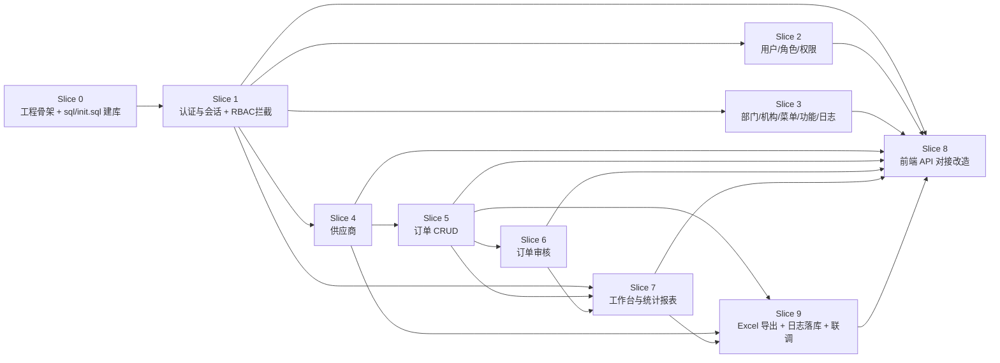

# 订单管理系统 实施 Plan

> **For agentic workers:** REQUIRED SUB-SKILL: Use superpowers:subagent-driven-development (recommended) or superpowers:executing-plans to implement this plan task-by-task. Steps use checkbox (`- [ ]`) syntax for tracking.
>
> **Goal:** 按 14 个 spec / 57 个 API / 14 张表，从零交付可运行的订单管理系统（Spring Boot 后端 + Vue3 前端）。
>
> **Architecture:** 单体分层 `Controller → Service → Mapper → SQLite`；前端由 `docs/prototype/` **复制**为 `frontend/` 后，将 plain JS store 的 mock 替换为 REST API 调用（architecture.md §4 关键约定）。
>
> **Tech Stack:** Spring Boot 3 + MyBatis-Plus + SQLite（jdbc:sqlite）+ JUnit5/MockMvc（TDD）；Vue 3 Options API + Vite + Vue Router 4 + plain JS store；Excel 用 Apache POI（.xls）。
>
> **TDD 约定（所有后端业务任务）:** RED → 写失败测试 → GREEN → 最小实现使测试通过 → REFACTOR → 重构后保持全绿。每任务结束跑 `mvn -q test`。
>
> **权威输入:** `sql/init.sql`（schema）、`docs/api/接口定义.md`（57 端点）、`docs/database/数据库设计.md`、`openspec/specs/*`（78 REQ）、`docs/architecture/architecture.md`。

---

## 依赖图



ASCII 简图：

```
[数据库 sql/init.sql] → [后端 API：Slice1 认证 → Slice2/3 系统管理 → Slice4 供应商 → Slice5 订单 → Slice6 审核 → Slice7 工作台/报表]
                                      ↘________________ Slice9 导出+日志落库 ________________↗
                                                        ↓
                                             [前端 Slice8：prototype → frontend/ 对接]
```

---

## 任务总览

| # | 切片 | 任务 | 目标 | 关键文件 | 预计耗时 | 验证方式 |
|---|---|---|---|---|---|---|
| 1 | S0 | T0.1 执行 init.sql 建库 | Step 0：生成 data/order-manage.db（14 表+索引+种子） | `sql/init.sql`、`data/order-manage.db` | 0.5h | `sqlite3`/Python 查询表数=14、种子行数 |
| 2 | S0 | T0.2 后端工程骨架 | Spring Boot 可启动 + 统一响应体/全局异常 | `backend/pom.xml`、`OrderManageApplication.java`、`common/*` | 2h | `mvn -q test` 空测通过；`mvn spring-boot:run` 启动 |
| 3 | S0 | T0.3 数据源与 14 表实体/Mapper | MyBatis-Plus + SQLite 接通，14 张表 Entity+Mapper | `config/MybatisPlusConfig.java`、`entity/*`、`mapper/*` | 3h | 上下文加载测试 `SELECT count(*) FROM tb_role`=3 |
| 4 | S0 | T0.4 通用分页与错误码基座 | PageResult/错误码 400/401/403/404/409/422 中文 message | `common/PageResult.java`、`GlobalExceptionHandler.java` | 2h | 异常处理单测覆盖各 code |
| 5 | S1 | T1.1 验证码接口 | `GET /api/auth/captcha` 返回 captcha_id+base64 图 | `controller/AuthController.java`、`service/CaptchaService.java` | 1.5h | MockMvc 200 + data 字段断言 |
| 6 | S1 | T1.2 登录接口 | `POST /api/auth/login`：密码错误计数/5次锁定/状态/首次改密 | `service/AuthService.java` | 4h | TDD：错误文案、锁定、停用、first_login 各 1 测 |
| 7 | S1 | T1.3 会话拦截器 + me/logout | Bearer token 401；`GET /api/auth/me`、`POST /api/auth/logout` | `config/TokenInterceptor.java`、`AuthController` | 3h | 无 token→401；logout 后原 token→401 |
| 8 | S1 | T1.4 修改密码（普通+强制） | `PUT /api/auth/password`、`PUT /api/auth/password/force` | `AuthController`、`PasswordValidator` | 2.5h | 密码规则/两次一致/新旧相同 400 测例 |
| 9 | S1 | T1.5 RBAC 功能权限拦截 | 按 `tb_role_function` 校验 `域:操作`，无权限 403 | `aspect/PermissionAspect.java` 或拦截器 | 3h | 普通用户调审核接口→403 测例 |
| 10 | S2 | T2.1 用户列表 | `GET /api/users` 筛选分页，不含密码字段 | `UserMapper`/`UserService`/`UserController` | 2h | MockMvc 分页+keyword 测例 |
| 11 | S2 | T2.2 新增/编辑用户 | `POST /api/users`、`PUT /api/users/{id}` 唯一性/引用校验 | `UserController` | 3h | 重名 409、角色不存在 400 |
| 12 | S2 | T2.3 启停/重置/删除用户 | `PUT .../status`、`PUT .../reset-password`、`DELETE /api/users/{id}` | `UserService` | 2.5h | admin 不可停/删 422；重置 first_login=true |
| 13 | S2 | T2.4 角色 CRUD | `GET/POST/PUT/DELETE /api/roles` | `RoleController`/`RoleService` | 3h | 被引用 422；code 不可改 |
| 14 | S2 | T2.5 角色权限读写 | `GET/PUT /api/roles/{id}/permissions` 全量覆盖；ROLE_ADMIN 422 | `RoleService` | 2.5h | 分配后 menus/permissions 生效测例 |
| 15 | S3 | T3.1 部门 CRUD | `GET/POST/PUT/DELETE /api/departments`（4 端点） | `DepartmentController` | 2h | DEPT-000 删除因 admin 引用→422 |
| 16 | S3 | T3.2 机构树 CRUD | `GET/POST/PUT/DELETE /api/organizations` 含祖先路径/末级校验 | `OrganizationController`/`OrgTreeService` | 3.5h | 筛选保留祖先；sub2 下级→422 |
| 17 | S3 | T3.3 菜单树 CRUD + tree | `GET /api/menus`、`GET /api/menus/tree`、`POST/PUT/DELETE /api/menus` | `MenuController` | 3.5h | 二级缺 route→422；有子菜单删→422 |
| 18 | S3 | T3.4 功能 CRUD | `GET/POST/PUT/DELETE /api/functions` + menu_function 同步 | `FunctionController` | 2.5h | perm 格式/唯一 400/409 |
| 19 | S3 | T3.5 操作日志查询 | `GET /api/logs` 默认 pageSize=5 且仅 5/10/20/50 | `LogController` | 1.5h | pageSize=7→400；非管理员 403 |
| 20 | S4 | T4.1 供应商列表 | `GET /api/suppliers` | `SupplierController` | 1.5h | keyword+status 组合测例 |
| 21 | S4 | T4.2 新增/编辑供应商 | `POST /api/suppliers`、`PUT /api/suppliers/{id}` | `SupplierService` | 2.5h | code 重复 409 |
| 22 | S4 | T4.3 删除/启停用 | `DELETE /api/suppliers/{id}`、`PUT .../status` | `SupplierService` | 2h | 被订单引用删→422 |
| 23 | S4 | T4.4 供应商下拉 | `GET /api/suppliers/options` 仅启用 | `SupplierController` | 1h | 停用 SUP-003 不出现 |
| 24 | S5 | T5.1 订单列表 | `GET /api/orders` 四条件与关系分页 | `OrderController`/`OrderService` | 2.5h | 组合筛选+翻页保持 |
| 25 | S5 | T5.2 新增订单 | `POST /api/orders` 状态固定待审核 | `OrderService` | 2.5h | 编号重复 409；停用供应商 422 |
| 26 | S5 | T5.3 编辑订单状态机 | `PUT /api/orders/{id}` 已完成 422；已驳回→待审核 | `OrderService` | 3h | 状态机 4 条 TDD 测例 |
| 27 | S5 | T5.4 删除/详情 | `DELETE /api/orders/{id}`、`GET /api/orders/{id}` | `OrderController` | 2h | 已完成删 422；404 |
| 28 | S6 | T6.1 审核列表 | `GET /api/order-audits` 联查最新审核+pending_count | `OrderAuditController` | 3h | 字段齐全；默认待审核 |
| 29 | S6 | T6.2 通过/驳回 | `POST /api/order-audits/{id}/pass|reject` | `OrderAuditService` | 3.5h | 非待审核 422；驳回意见必填；仅审核员 |
| 30 | S6 | T6.3 审核记录 | `GET /api/orders/{id}/audits` | `OrderAuditController` | 1.5h | 驳回后记录含 opinion |
| 31 | S7 | T7.1 工作台统计 | `GET /api/workbench/stats` 实时 COUNT | `WorkbenchController` | 1.5h | 与订单状态变更联动 |
| 32 | S7 | T7.2 报表聚合 | `GET /api/reports/summary` 饼/柱/折线；仅管理员 | `ReportController` | 3h | 非管理员 403；percent 1 位小数 |
| 33 | S7 | T7.3 报表明细 | `GET /api/reports/detail` | `ReportController` | 1.5h | 与 summary 同筛选 |
| 34 | S9 | T9.1 订单导出 | `GET /api/orders/export` .xls | `ExcelExporter`、`OrderController` | 2.5h | 响应头+POI 解析行数 |
| 35 | S9 | T9.2 供应商/报表导出 | `GET /api/suppliers/export`、`GET /api/reports/export` | `SupplierController`、`ReportController` | 2h | 两个导出测例 |
| 36 | S9 | T9.3 操作日志落库 | 关键写操作写 `tb_operation_log` | `aspect/OperationLogAspect.java` | 3h | 登录/CRUD 后查表有新行 |
| 37 | S9 | T9.4 后端联调收尾 | 全量 `mvn test` + 57 端点 curl 冒烟清单 | `docs/plans/` 勾选 + 测试报告 | 3h | `mvn -q test` 全绿 |
| 38 | S8 | T8.1 frontend 工程与 API 层 | 复制 prototype→frontend/，新增 `src/api/request.js` | `frontend/`、`frontend/src/api/*` | 2.5h | `npm run build` 通过 |
| 39 | S8 | T8.2 认证页对接 | 路由 `/login`、`/force-password`、`/change-password` + Layout 菜单 | `Login.vue`、`Layout.vue`、`router/index.js`（修改） | 4h | 真实登录进工作台；token 注入 |
| 40 | S8 | T8.3 工作台+订单列表对接 | `/workbench`、`/orders/list` | `Workbench.vue`、`OrderList.vue`（修改） | 4h | 筛选/增删改查走 API |
| 41 | S8 | T8.4 审核+供应商对接 | `/order-audit/list`、`/suppliers/list` | `OrderAuditList.vue`、`SupplierList.vue`（修改） | 3.5h | 通过/驳回/启停用真实生效 |
| 42 | S8 | T8.5 报表对接 | `/reports/home` | `ReportHome.vue`（修改） | 3h | 图表数据来自 summary/detail |
| 43 | S8 | T8.6 系统管理 7 页对接 | `/system/users|roles|departments|organizations|menus|functions|logs` | 对应 7 个 vue（修改） | 5h | 各页 CRUD+权限分配可用 |
| 44 | S8 | T8.7 模板页清理与前端验收 | Dashboard/ExamplePage 可选删除；全路由回归 | `router/index.js`、`Layout.vue` | 2h | `npm run build`；无 mock 残留 grep |

**合计：44 个任务，约 118 小时（单人）；任务数落在 30~60 区间。**

---

## 垂直切片任务详情

### Slice 0: 工程骨架与数据库

#### T0.1 Step 0：执行 sql/init.sql 建库

- **目标:** 生成权威 SQLite 库，作为一切数据层与联调的基线（14 表、23 索引、12 处 INSERT）。
- **文件路径:** `sql/init.sql`（只读执行）→ `data/order-manage.db`（生成物）；`.gitignore` 确认忽略 `data/*.db`（若未忽略则补充，仅此一处允许改 gitignore）。
- **预计耗时:** 0.5h
- **要点/代码片段:**

```powershell
New-Item -ItemType Directory -Force -Path data | Out-Null
python -c "import sqlite3,sys; c=sqlite3.connect('data/order-manage.db'); c.executescript(open('sql/init.sql',encoding='utf-8').read()); c.commit(); print([r[0] for r in c.execute(\"SELECT name FROM sqlite_master WHERE type='table' AND name LIKE 'tb_%' ORDER BY name\")])"
```

  期望输出 14 张表：`tb_department, tb_function, tb_menu, tb_menu_function, tb_order, tb_order_audit, tb_operation_log, tb_organization, tb_role, tb_role_function, tb_role_menu, tb_supplier, tb_user, tb_user_role`。
- **验证:**

```powershell
python -c "import sqlite3; c=sqlite3.connect('data/order-manage.db'); print('roles',c.execute('SELECT count(*) FROM tb_role').fetchone()[0]); print('menus',c.execute('SELECT count(*) FROM tb_menu').fetchone()[0]); print('funcs',c.execute('SELECT count(*) FROM tb_function').fetchone()[0]); print('users',c.execute('SELECT count(*) FROM tb_user').fetchone()[0]); print('logs',c.execute('SELECT count(*) FROM tb_operation_log').fetchone()[0])"
# 期望: roles 3 / menus 17 / funcs 32 / users 1 / logs 5
```

#### T0.2 后端工程骨架（统一响应体 + 全局异常）

- **目标:** 创建 `backend/` Spring Boot 工程，落地统一响应体 `{code,message,data}` 与全局异常→中文 message 映射（对齐接口定义「状态码与错误码」）。
- **文件路径:**
  - Create: `backend/pom.xml`
  - Create: `backend/src/main/resources/application.yml`
  - Create: `backend/src/main/java/com/example/ordermanage/OrderManageApplication.java`
  - Create: `backend/src/main/java/com/example/ordermanage/common/Result.java`
  - Create: `backend/src/main/java/com/example/ordermanage/common/BizException.java`（`code + message`）
  - Create: `backend/src/main/java/com/example/ordermanage/common/GlobalExceptionHandler.java`
  - Test: `backend/src/test/java/com/example/ordermanage/common/GlobalExceptionHandlerTest.java`
- **预计耗时:** 2h
- **要点/代码片段:**

```java
// Result.java
public record Result<T>(int code, String message, T data) {
  public static <T> Result<T> ok(T data) { return new Result<>(200, "success", data); }
  public static <T> Result<T> fail(int code, String message) { return new Result<>(code, message, null); }
}
```

```java
// GlobalExceptionHandler: @RestControllerAdvice
// BizException → status=code, body Result.fail(code, e.getMessage())
// MethodArgumentNotValidException → 400 中文校验信息
// 分支覆盖: 400/401/403/404/409/422（HTTP 状态与业务 code 同值）
```

```xml
<!-- pom.xml 关键依赖: spring-boot-starter-web, mybatis-plus-spring-boot3-starter,
     xerial sqlite-jdbc, spring-boot-starter-test, poi 5.x, lombok(可选) -->
```

```yaml
# application.yml
spring:
  datasource:
    url: jdbc:sqlite:${ORDER_DB:../data/order-manage.db}
    driver-class-name: org.sqlite.JDBC
server:
  port: 8080
```

- **验证（TDD）:**

```powershell
# RED: GlobalExceptionHandlerTest 断言 BizException(422,"已完成订单不可编辑") → status 422 + JSON code=422
mvn -q -Dtest=GlobalExceptionHandlerTest test   # 先 FAIL 再 GREEN
mvn -q test
mvn -q spring-boot:run   # 另开窗口 curl http://localhost:8080/ 应返回 JSON 错误而非 Whitelabel
```

#### T0.3 SQLite 数据源 + 14 表 Entity/Mapper

- **目标:** MyBatis-Plus 接通 SQLite；为 14 张表建 Entity（snake_case 列映射）与空 `BaseMapper`，打通读写。
- **文件路径:**
  - Create: `backend/src/main/java/com/example/ordermanage/config/MybatisPlusConfig.java`（分页插件 `PaginationInnerInterceptor`）
  - Create: `backend/src/main/java/com/example/ordermanage/entity/{User,Role,UserRole,Department,Organization,Menu,Function,MenuFunction,RoleMenu,RoleFunction,Supplier,Order,OrderAudit,OperationLog}PO.java`（或无 PO 后缀）
  - Create: `backend/src/main/java/com/example/ordermanage/mapper/{User,Role,UserRole,Department,Organization,Menu,Function,MenuFunction,RoleMenu,RoleFunction,Supplier,Order,OrderAudit,OperationLog}Mapper.java`
  - Test: `backend/src/test/java/com/example/ordermanage/mapper/SchemaSmokeTest.java`
- **预计耗时:** 3h
- **要点/代码片段:**

```java
@TableName("tb_order")
public class Order {
  @TableId(type = IdType.AUTO) private Long id;
  @TableField("order_no") private String orderNo;
  private String name;
  private BigDecimal amount;
  @TableField("supplier_id") private Long supplierId;
  private String status;
  private String remark;
  @TableField("create_time") private LocalDateTime createTime;
  @TableField("update_time") private LocalDateTime updateTime;
  // getter/setter 或 lombok
}

public interface OrderMapper extends BaseMapper<Order> {}
```

  注意：密码列 `password` 永不出现在任何 DTO/API 序列化中（REQ-USER-007）。
- **验证（TDD）:**

```powershell
# RED→GREEN: SchemaSmokeTest @MybatisTest 或 @SpringBootTest
# 断言 roleMapper.selectCount(null)==3, menuMapper.selectCount(null)==17,
#      functionMapper.selectCount(null)==32, userMapper.selectCount(null)==1,
#      operationLogMapper.selectCount(null)==5, supplierMapper.selectCount(null)==3
mvn -q -Dtest=SchemaSmokeTest test
```

#### T0.4 通用分页与错误码基座

- **目标:** 落地全局唯一分页结构 `data={total,list}`、`page/pageSize` 默认值，以及业务码工具（409 冲突、404、422 文案常量）。
- **文件路径:**
  - Create: `backend/src/main/java/com/example/ordermanage/common/PageResult.java`
  - Create: `backend/src/main/java/com/example/ordermanage/common/Err.java`（常量文案，如 `已完成订单不可编辑`）
  - Create: `backend/src/main/java/com/example/ordermanage/common/PageParam.java`（`page≥1`，`pageSize 1..100`，非法→400）
  - Test: `backend/src/test/java/com/example/ordermanage/common/PageResultTest.java`
- **预计耗时:** 2h
- **要点/代码片段:**

```java
public record PageResult<T>(long total, List<T> list) {
  public static <T> PageResult<T> of(IPage<T> page) {
    return new PageResult<>(page.getTotal(), page.getRecords());
  }
}
// 统一响应: Result.ok(PageResult.of(page)) → {"code":200,"data":{"total":n,"list":[...]}}
```

- **验证（TDD）:**

```powershell
mvn -q -Dtest=PageResultTest test
# 断言: page=0 → 400; 正常页 → total/list 键名与接口定义一致
```

---

### Slice 1: 认证与会话

#### T1.1 验证码 GET /api/auth/captcha

- **目标:** 返回 `captcha_id` 与 4 位图形验证码 base64（data URI），服务端暂存待登录校验；点击刷新=重新请求本接口（REQ-AUTH-002）。
- **文件路径:**
  - Create: `backend/src/main/java/com/example/ordermanage/controller/AuthController.java`
  - Create: `backend/src/main/java/com/example/ordermanage/service/CaptchaService.java`（内存 `ConcurrentHashMap<captchaId, code>`，TTL 5min）
  - Test: `backend/src/test/java/com/example/ordermanage/controller/AuthControllerCaptchaTest.java`
- **预计耗时:** 1.5h
- **要点/代码片段:**

```java
@GetMapping("/api/auth/captcha")
public Result<Map<String, String>> captcha() {
  String id = "cap_" + UUID.randomUUID().toString().substring(0, 8);
  String code = random4(); // 不区分大小写存储
  captchaStore.put(id, code.toLowerCase(), 5, MINUTES);
  return Result.ok(Map.of("captcha_id", id, "image", "data:image/png;base64," + renderPng(code)));
}
```

- **验证（TDD）:**

```powershell
mvn -q -Dtest=AuthControllerCaptchaTest test
# MockMvc: GET /api/auth/captcha → 200; data.captcha_id 非空; data.image 以 data:image/png 开头
```

#### T1.2 登录 POST /api/auth/login

- **目标:** 实现完整登录业务：缺失提示、验证码、密码错误计数与 5 次锁定、停用拒绝、成功重置计数并返回 token/user/menus/permissions/first_login（REQ-AUTH-001/003/004/008）。
- **文件路径:**
  - Create: `backend/src/main/java/com/example/ordermanage/service/AuthService.java`
  - Create: `backend/src/main/java/com/example/ordermanage/service/TokenService.java`（内存 token→userId，logout 失效）
  - Create: `backend/src/main/java/com/example/ordermanage/service/PermissionQueryService.java`（查 `tb_role_menu`/`tb_role_function` 组装 menus 树 + permissions 列表）
  - Modify: `AuthController.java`（新增 login）
  - Test: `.../AuthServiceLoginTest.java`
- **预计耗时:** 4h
- **要点/代码片段:**

```java
// 登录失败文案（HTTP 401，与接口定义「认证类失败」逐字一致）:
// 「请输入用户名和密码」「请输入验证码」「验证码错误」
// 「用户名或密码错误」「密码错误，还剩 N 次机会」
// 「账户已锁定；密码错误次数过多，请联系系统管理员解锁」
// 「账户已禁用，请联系系统管理员启用」
// 种子 admin 密码: 明文 123456，库中 MD5 e10adc3949ba59abbe56e057f20f883e（见 sql/init.sql 注释）
// fail_count 连续 5 次锁定；登录成功清零；first_login 决定响应 first_login 字段
```

  menus 树：按用户角色 `tb_role_menu` 过滤 `tb_menu`，组 `children`；permissions：`tb_function.perm` 列表。
- **验证（TDD）:**

```powershell
mvn -q -Dtest=AuthServiceLoginTest test
# 测例: 错密码×4→"还剩 1 次"; 第 5 次→锁定文案; 停用用户→禁用文案;
#       正确登录→token 非空 + menus 含 MENU_WORKBENCH + permissions 含 order:query
#       非首次登录 first_login=false
```

#### T1.3 会话拦截器 + me/logout

- **目标:** 全局 `Authorization: Bearer` 校验（除登录/验证码），失效 401；实现 `GET /api/auth/me`（刷新页面恢复）、`POST /api/auth/logout`（服务端 token 立即失效）。
- **文件路径:**
  - Create: `backend/src/main/java/com/example/ordermanage/config/TokenInterceptor.java`
  - Create: `backend/src/main/java/com/example/ordermanage/config/WebConfig.java`（注册拦截器，排除 `/api/auth/captcha`、`/api/auth/login`）
  - Create: `backend/src/main/java/com/example/ordermanage/context/LoginUser.java` + `UserContext`（ThreadLocal）
  - Modify: `AuthController.java`（me/logout）
  - Test: `.../TokenInterceptorTest.java`
- **预计耗时:** 3h
- **要点/代码片段:**

```java
// 拦截: 无头/坏 token → Result.fail(401, "未认证") + HTTP 401
// me: 返回登录响应去掉 token 的 user+menus+permissions
// logout: tokenStore.remove(token); 之后同 token 请求必须 401
```

- **验证（TDD）:**

```powershell
mvn -q -Dtest=TokenInterceptorTest test
# 1) 无 token GET /api/auth/me → 401
# 2) 登录取 token → me 200 且 user.username=admin
# 3) logout → 再用原 token me → 401
```

#### T1.4 修改密码（普通 + 首次强制）

- **目标:** `PUT /api/auth/password`（需旧密码、新旧不同）与 `PUT /api/auth/password/force`（无旧密码）；规则 8-20 位且≥3 种字符；成功后 force 模式清 token 且 first_login=false（REQ-AUTH-006/007）。
- **文件路径:**
  - Create: `backend/src/main/java/com/example/ordermanage/common/PasswordValidator.java`
  - Modify: `AuthController.java`、`AuthService.java`
  - Test: `.../AuthPasswordTest.java`
- **预计耗时:** 2.5h
- **要点/代码片段:**

```java
// 规则: ^.{8,20}$ 且 [A-Z]+[a-z]+[0-9]+[^A-Za-z0-9] 中命中 ≥3 类
// 400 文案: 「请输入当前密码」「请填写新密码」「密码不符合安全规则」
//           「两次密码不一致」「新密码不能与当前密码相同」
// force 成功: first_login=false + 当前 token 失效（前端提示后 1.5s 跳 /login）
```

- **验证（TDD）:**

```powershell
mvn -q -Dtest=AuthPasswordTest test
# 覆盖: 弱密码 400 / 两次不一致 400 / 新旧相同 400 / 普通改密 200 / force 200 后旧 token 401
```

#### T1.5 RBAC 功能权限拦截（`域:操作`）

- **目标:** 接口级权限 = 登录态 + 角色功能权限 + 菜单权限（接口定义「权限模型」）；无权限 HTTP 403。提供 `@RequirePerm("order:query")` 注解供各业务 Controller 使用。
- **文件路径:**
  - Create: `backend/src/main/java/com/example/ordermanage/annotation/RequirePerm.java`
  - Create: `backend/src/main/java/com/example/ordermanage/aspect/PermissionAspect.java`（或 HandlerInterceptor）
  - Create: `backend/src/main/java/com/example/ordermanage/service/PermissionQueryService.java`（扩展：当前用户 perm 集合缓存）
  - Test: `.../PermissionAspectTest.java`
- **预计耗时:** 3h
- **要点/代码片段:**

```java
@RequirePerm("order:query")
@GetMapping("/api/orders") ...

// Aspect: 取 UserContext → 查角色功能权限集合 → 不含 perm → BizException(403, "无权限")
// 审核 pass/reject 额外规则: 业务上仅 ROLE_AUDITOR 实际执行，管理员虽有全部功能仍 403（接口 4.2 说明）
```

- **验证（TDD）:**

```powershell
mvn -q -Dtest=PermissionAspectTest test
# 用例: ROLE_USER 调 POST /api/order-audits/1/pass → 403
#       ROLE_AUDITOR 调 GET /api/users → 403
#       ROLE_ADMIN 调 GET /api/users → 200
```

---

### Slice 2: 系统管理-用户/角色/权限

#### T2.1 用户列表 GET /api/users

- **目标:** 管理员分页查询用户，支持 keyword/role_id/status/department_id/organization_id；响应**绝不含密码字段**（REQ-USER-001/007）。
- **文件路径:**
  - Create: `backend/.../controller/UserController.java`
  - Create: `backend/.../service/UserService.java`
  - Create: `backend/.../dto/UserListItem.java`（id,username,real_name,role_id,role_name,department_id,department_name,organization_id,organization_name,status,first_login,fail_count,locked,remark,create_time）
  - Test: `.../UserListTest.java`
- **预计耗时:** 2h
- **要点/代码片段:**

```java
@RequirePerm("user:query") // 或按菜单权限校验，对齐接口「仅管理员+用户管理菜单」
@GetMapping("/api/users")
public Result<PageResult<UserListItem>> list(UserQuery q, PageParam p) {
  return Result.ok(UserService.page(q, p)); // 联查 role/department/organization 名称
}
// locked = fail_count >= 5
```

- **验证（TDD）:**

```powershell
mvn -q -Dtest=UserListTest test
# 200 且 list[0].username=admin; JSON 不含 "password" 键; keyword 筛选 total 正确
```

#### T2.2 新增/编辑用户（POST/PUT /api/users）

- **目标:** 创建与编辑用户：username 唯一 409；role/department/organization 必须存在；创建时写入默认初始密码哈希且 first_login=true（REQ-USER-002/003）。
- **文件路径:**
  - Modify: `UserController.java`、`UserService.java`
  - Create: `backend/.../dto/UserSaveRequest.java`
  - Test: `.../UserSaveTest.java`
- **预计耗时:** 3h
- **要点/代码片段:**

```java
// POST body: {username, real_name, role_id, department_id, organization_id, status?, remark?}
// 重名 → BizException(409, "用户名已存在")
// 默认初始密码明文 Uu888888! → MD5/既定哈希入库（与 PasswordValidator 规则一致）, first_login=true
// PUT: 同校验; 不接受 password 字段(传入忽略); code 语义: username 可改但须唯一
```

- **验证（TDD）:**

```powershell
mvn -q -Dtest=UserSaveTest test
# 重复 username → 409 "用户名已存在"; 不存在 role_id → 400; 创建响应 first_login=true 且无 password
```

#### T2.3 启停用 / 重置密码 / 删除用户

- **目标:** 实现 `PUT /api/users/{id}/status`、`PUT /api/users/{id}/reset-password`、`DELETE /api/users/{id}`；admin 保护与引用清理（REQ-USER-004/005/006/008）。
- **文件路径:**
  - Modify: `UserController.java`、`UserService.java`
  - Test: `.../UserStatusResetDeleteTest.java`
- **预计耗时:** 2.5h
- **要点/代码片段:**

```java
// status: 仅 启用/停用; username=admin && 停用 → 422「默认管理员 admin 不可停用」
// reset-password: 置默认密码哈希 + first_login=true + fail_count=0 + 解锁;
//   响应 {id, default_password:"Uu888888!", first_login:true}（仅此接口返回明文）
// delete: admin → 422「默认管理员 admin 不可删除」; 同步删 tb_user_role; 不存在 → 404
```

- **验证（TDD）:**

```powershell
mvn -q -Dtest=UserStatusResetDeleteTest test
# 4 条主路径 + 404 + admin 两处 422
```

#### T2.4 角色 CRUD（GET/POST/PUT/DELETE /api/roles）

- **目标:** 角色分页与增删改；code 唯一、不可修改；删除时清理 `tb_role_menu`/`tb_role_function`；被用户引用 422（REQ-ROLE-001~004）。
- **文件路径:**
  - Create: `backend/.../controller/RoleController.java`、`service/RoleService.java`、`dto/*`
  - Test: `.../RoleCrudTest.java`
- **预计耗时:** 3h
- **要点/代码片段:**

```java
// GET: keyword 模糊编号/名称; 响应含 menu_count/function_count/user_count/builtin
// POST: name 必填「请输入角色名称」; code 缺省服务端生成; 新角色权限为空
// PUT: name/remark; code 传入忽略
// DELETE: user 引用数>0 → 422「该角色已被用户引用，无法删除」; 级联删两张授权表
```

- **验证（TDD）:**

```powershell
mvn -q -Dtest=RoleCrudTest test
# 新建→menu_count=0; 删被引用→422; code 重复→409
```

#### T2.5 角色权限查询/分配（GET/PUT /api/roles/{id}/permissions）

- **目标:** 读回 `menu_ids`/`function_ids`；保存为**全量覆盖**（先清后写）；ROLE_ADMIN 拒绝修改 422（REQ-ROLE-005/006）。
- **文件路径:**
  - Modify: `RoleController.java`、`RoleService.java`
  - Test: `.../RolePermissionAssignTest.java`
- **预计耗时:** 2.5h
- **要点/代码片段:**

```java
@GetMapping("/api/roles/{id}/permissions") // → {role_id, menu_ids:[], function_ids:[]}
@PutMapping("/api/roles/{id}/permissions")  // body {menu_ids:[], function_ids:[]}
// code=ROLE_ADMIN → 422「管理员角色权限不可修改」
// 事务: DELETE FROM tb_role_menu WHERE role_id=?; 批量 INSERT; function 同理
```

- **验证（TDD）:**

```powershell
mvn -q -Dtest=RolePermissionAssignTest test
# 分配 5 菜单→GET 回读一致; 改 ROLE_ADMIN→422; 改后登录该角色用户 menus 变化（集成断言）
```

---

### Slice 3: 部门/机构/菜单/功能/日志

#### T3.1 部门 CRUD（4 端点）

- **目标:** `GET /api/departments`、`POST /api/departments`、`PUT /api/departments/{id}`、`DELETE /api/departments/{id}`；code 唯一 409；被用户引用 422；初始化仅 DEPT-000（REQ-DEPT-001~005）。
- **文件路径:**
  - Create: `backend/.../controller/DepartmentController.java`、`service/DepartmentService.java`
  - Test: `.../DepartmentCrudTest.java`
- **预计耗时:** 2h
- **要点/代码片段:**

```java
// POST {code,name,remark?} → 409「部门编号已存在」
// DELETE → EXISTS(SELECT 1 FROM tb_user WHERE department_id=?) → 422「该部门已被用户引用，无法删除」
// GET 初始 total=1（DEPT-000 总部）
```

- **验证（TDD）:** `mvn -q -Dtest=DepartmentCrudTest test`；删总部因 admin 引用→422。

#### T3.2 机构树 CRUD（4 端点，5 级）

- **目标:** 树形分页 `GET /api/organizations`（按根分页）+ 筛选保留祖先路径；`POST /api/organizations`、`PUT /api/organizations/{id}`、`DELETE /api/organizations/{id}`；新增顶级/下级由 `parent_id` 推导 level；末级 sub2 不可加下级；code 仅字母数字且不可改（REQ-ORG-001~005）。
- **文件路径:**
  - Create: `backend/.../controller/OrganizationController.java`、`service/OrganizationService.java`、`dto/OrgTreeNode.java`
  - Test: `.../OrganizationTreeTest.java`
- **预计耗时:** 3.5h
- **要点/代码片段:**

```java
// level 链: hq → branch1 → branch2 → sub1 → sub2（再加下级 → 422「已达最末级，不可新增下级」）
// code !^[A-Za-z0-9]+$ → 422「机构编号只能包含字母和数字」
// DELETE: 有 children → 422「该机构下有下级机构，无法删除」
// GET 筛选: 返回匹配节点 + 其祖先链，children 嵌套
```

- **验证（TDD）:** `mvn -q -Dtest=OrganizationTreeTest test`（树深、祖先保留、末级 422、删有子 422）。

#### T3.3 菜单树 CRUD + 全量 tree（5 端点）

- **目标:** `GET /api/menus`（一级分页树）、`GET /api/menus/tree`（全量+挂载 functions）、`POST/PUT/DELETE /api/menus`；二级必填 route；删除级联清 `tb_menu_function`/`tb_role_menu`（REQ-MENU-001~006）。
- **文件路径:**
  - Create: `backend/.../controller/MenuController.java`、`service/MenuService.java`
  - Test: `.../MenuTreeTest.java`
- **预计耗时:** 3.5h
- **要点/代码片段:**

```java
// GET /api/menus?page&pageSize → 按一级菜单分页, children 二级
// GET /api/menus/tree → 全量 17 菜单, 节点附 functions:[{id,code,name,perm}]（供权限分配弹窗）
// POST parent_id=null → level1; 有 parent → level2 且 route 必填否则 422「二级菜单必须配置路由」
// DELETE 有子 → 422「该菜单下存在子菜单，无法删除」
```

- **验证（TDD）:** `mvn -q -Dtest=MenuTreeTest test`；tree 初始 17 节点、functions 挂载 32。

#### T3.4 功能 CRUD（4 端点）

- **目标:** `GET /api/functions`、`POST /api/functions`、`PUT /api/functions/{id}`、`DELETE /api/functions/{id}`；perm `域:操作` 格式与唯一；维护 `tb_menu_function` 同步（REQ-FUNC-001~005）。
- **文件路径:**
  - Create: `backend/.../controller/FunctionController.java`、`service/FunctionService.java`
  - Test: `.../FunctionCrudTest.java`
- **预计耗时:** 2.5h
- **要点/代码片段:**

```java
// perm 必须匹配 ^[^:]+:[^:]+$ 否则 400; 重复 perm → 409
// POST/PUT 成功后 upsert tb_menu_function(menu_id, function_id)
// DELETE: 同步删 tb_menu_function + tb_role_function
```

- **验证（TDD）:** `mvn -q -Dtest=FunctionCrudTest test`。

#### T3.5 操作日志查询 GET /api/logs

- **目标:** 分页筛选日志；默认 pageSize=5，仅允许 5/10/20/50；仅管理员（菜单+`log:view`）（REQ-LOG-001~004）。
- **文件路径:**
  - Create: `backend/.../controller/LogController.java`、`service/LogService.java`
  - Test: `.../LogListTest.java`
- **预计耗时:** 1.5h
- **要点/代码片段:**

```java
@RequirePerm("log:view")
@GetMapping("/api/logs")
// filters: operator/action/target/ip 模糊 + date 精确日; 多条件 AND
// pageSize 非法(非 5/10/20/50) → 400; 默认 5; 无数据 list:[]
```

- **验证（TDD）:** `mvn -q -Dtest=LogListTest test`；ROLE_AUDITOR→403。

---

### Slice 4: 供应商

#### T4.1 供应商列表 GET /api/suppliers

- **目标:** keyword（名称/联系人）+ status 分页（REQ-SUP-001）。
- **文件路径:** Create `SupplierController.java`、`SupplierService.java`、`entity/Supplier`（T0.3 已建则复用）；Test `SupplierListTest.java`。
- **预计耗时:** 1.5h
- **要点/代码片段:**

```java
@RequirePerm("supplier:query")
// QueryWrapper: like(name||contact, keyword).eq(status)
```

- **验证（TDD）:** `mvn -q -Dtest=SupplierListTest test`（初始 total=3，status=停用筛出 SUP-003）。

#### T4.2 新增/编辑供应商（POST/PUT）

- **目标:** code 唯一 409；必填 code/name/contact/phone；编辑忽略 code（REQ-SUP-002/003）。
- **文件路径:** Modify `SupplierController/Service`；Create `dto/SupplierSaveRequest`；Test `SupplierSaveTest.java`。
- **预计耗时:** 2.5h
- **要点/代码片段:**

```java
// POST 缺 phone → 400; 重复 code → 409「供应商编号已存在」; status 默认 启用
// PUT body 含 status 启用/停用（弹窗内状态切换走本接口）
```

- **验证（TDD）:** `mvn -q -Dtest=SupplierSaveTest test`。

#### T4.3 删除 / 启停用（DELETE、PUT .../status）

- **目标:** 被 `tb_order.supplier_id` 引用不可删 422；行内快捷启停用独立端点（REQ-SUP-004/005）。
- **文件路径:** Modify `SupplierController/Service`；Test `SupplierDeleteStatusTest.java`。
- **预计耗时:** 2h
- **要点/代码片段:**

```java
// DELETE: SELECT count(*) FROM tb_order WHERE supplier_id=? >0 → 422「该供应商已被订单引用，无法删除」
// PUT /{id}/status body {status:启用|停用} → 返回 {id,status}; 停用后 options 不再返回
```

- **验证（TDD）:** `mvn -q -Dtest=SupplierDeleteStatusTest test`（建订单后删 SUP-001→422）。

#### T4.4 供应商下拉 GET /api/suppliers/options

- **目标:** 订单表单/报表筛选用，仅返回启用供应商 `{id,code,name}[]`（REQ-SUP-005）。
- **文件路径:** Modify `SupplierController.java`；Test `SupplierOptionsTest.java`。
- **预计耗时:** 1h
- **要点/代码片段:**

```java
@GetMapping("/api/suppliers/options") // status 默认 启用; 登录即可, 供 order:query 或所有登录用户
// 断言: SUP-003(停用) 不在列表; SUP-001/002 在
```

- **验证（TDD）:** `mvn -q -Dtest=SupplierOptionsTest test`。

---

### Slice 5: 订单 CRUD

#### T5.1 订单列表 GET /api/orders

- **目标:** keyword/supplier_id/status/start_date/end_date 组合「与」筛选 + 分页（REQ-ORDER-001）。
- **文件路径:** Create `OrderController.java`、`OrderService.java`、`dto/OrderListItem.java`（含 supplier_name 联查）；Test `OrderListTest.java`。
- **预计耗时:** 2.5h
- **要点/代码片段:**

```java
@RequirePerm("order:query")
// create_time 闭区间: start_date 00:00:00 ~ end_date 23:59:59（按日期部分）
// 联查 tb_supplier 取 supplier_name
```

- **验证（TDD）:** `mvn -q -Dtest=OrderListTest test`（四条件组合、翻页保筛选）。

#### T5.2 新增订单 POST /api/orders

- **目标:** 必填校验、编号唯一 409、供应商须存在且启用、status 固定「待审核」、时间服务端生成（REQ-ORDER-002、REQ-SUP-005）。
- **文件路径:** Modify `OrderController/Service`；Create `dto/OrderSaveRequest`；Test `OrderCreateTest.java`。
- **预计耗时:** 2.5h
- **要点/代码片段:**

```java
// amount < 0 → 400「金额不能为负数」
// 重复 order_no → 409
// supplier 不存在或 status!=启用 → 422「该供应商已停用，不可选择」(或 400 对齐接口 3.2)
// status = "待审核"
```

- **验证（TDD）:** `mvn -q -Dtest=OrderCreateTest test`。

#### T5.3 编辑订单状态机 PUT /api/orders/{id}

- **目标:** 仅待审核/已驳回可编辑；已完成 422；已驳回保存成功自动回「待审核」（REQ-ORDER-003、REQ-AUDIT-003 联动）。
- **文件路径:** Modify `OrderController/Service`；Test `OrderUpdateStateMachineTest.java`。
- **预计耗时:** 3h
- **要点/代码片段:**

```java
// 状态机:
//   待审核 --edit--> 待审核
//   已驳回 --edit成功--> 待审核   // 无需重新提交按钮
//   已完成 --edit--> 422「已完成订单不可编辑」
// order_no 不可改（传入忽略）
```

- **验证（TDD）:**

```powershell
mvn -q -Dtest=OrderUpdateStateMachineTest test
# 4 测例: 待审核保存/驳回回待审核/已完成422/负金额400
```

#### T5.4 删除 / 详情（DELETE、GET /{id}）

- **目标:** 已完成不可删 422；不存在 404；详情返回单条完整对象（REQ-ORDER-004/005）。
- **文件路径:** Modify `OrderController/Service`；Test `OrderDeleteDetailTest.java`。
- **预计耗时:** 2h
- **要点/代码片段:**

```java
// DELETE 仅 待审核|已驳回; 已完成 → 422「已完成订单不可删除」; 二次确认在前端
// GET /{id} 不存在 → 404
```

- **验证（TDD）:** `mvn -q -Dtest=OrderDeleteDetailTest test`。

---

### Slice 6: 订单审核

#### T6.1 审核列表 GET /api/order-audits

- **目标:** 专用接口联查订单+最新 `tb_order_audit`（auditor/audit_time/opinion）+ `pending_count` 角标；默认前端传 status=待审核（REQ-AUDIT-001）。
- **文件路径:** Create `OrderAuditController.java`、`OrderAuditService.java`、`dto/OrderAuditListItem.java`；Test `OrderAuditListTest.java`。
- **预计耗时:** 3h
- **要点/代码片段:**

```java
// JOIN 最新审核记录: 每 order_id 取 create_time 最大的一条 tb_order_audit
// 无审核记录 → auditor/audit_time/opinion = null
// pending_count = COUNT(*) WHERE status='待审核'（每页响应携带）
// 权限: 审核菜单 + order:query
```

- **验证（TDD）:** `mvn -q -Dtest=OrderAuditListTest test`。

#### T6.2 审核通过/驳回（POST pass/reject）

- **目标:** 仅待审核可审 422；通过→已完成；驳回→已驳回且 opinion 必填≤255；写 `tb_order_audit`；仅审核员可执行 403（REQ-AUDIT-002~004）。
- **文件路径:** Modify `OrderAuditController/Service`；Test `OrderAuditPassRejectTest.java`。
- **预计耗时:** 3.5h
- **要点/代码片段:**

```java
@PostMapping("/api/order-audits/{id}/pass")   // body {opinion?}
@PostMapping("/api/order-audits/{id}/reject") // body {opinion} 必填
// 非待审核 → 422「仅待审核订单可审核」
// reject 空 opinion → 400「驳回时审核意见必填」
// 角色非 ROLE_AUDITOR（含管理员点按）→ 403（对齐接口 4.2 说明）
// 审核人 = UserContext.real_name/username
// 响应: {order_id, status, audit:{result,auditor,opinion,audit_time}}
```

- **验证（TDD）:**

```powershell
mvn -q -Dtest=OrderAuditPassRejectTest test
# pass→已完成+审计行; reject→已驳回+意见; 二次审核非待审核→422; 管理员直接调→403
```

#### T6.3 订单审核记录 GET /api/orders/{id}/audits

- **目标:** 返回该订单全部审核痕迹数组（REQ-AUDIT-005）。
- **文件路径:** Modify `OrderAuditController.java`；Test `OrderAuditsHistoryTest.java`。
- **预计耗时:** 1.5h
- **要点/代码片段:**

```java
@GetMapping("/api/orders/{id}/audits")
// ORDER BY create_time ASC; 字段 id,order_id,result,auditor,opinion,create_time
// 权限: 拥有审核菜单的角色
```

- **验证（TDD）:** `mvn -q -Dtest=OrderAuditsHistoryTest test`（驳回→编辑回待审核→再通过，历史 2 条）。

---

### Slice 7: 工作台与统计报表

#### T7.1 工作台统计 GET /api/workbench/stats

- **目标:** 实时 COUNT 五指标 + 欢迎待办文案（REQ-WB-001~003）。
- **文件路径:** Create `WorkbenchController.java`、`service/WorkbenchService.java`；Test `WorkbenchStatsTest.java`。
- **预计耗时:** 1.5h
- **要点/代码片段:**

```java
// total/pending/done/rejected = GROUP BY status 或 3 次 COUNT; active_suppliers = status='启用'
// welcome.pending_count == pending_orders; rejected_count 同理
// 不缓存: 每次实时查询
```

- **验证（TDD）:** `mvn -q -Dtest=WorkbenchStatsTest test`；新建/审核一笔后 stats 变化。

#### T7.2 报表聚合 GET /api/reports/summary

- **目标:** 饼图 status_dist（percent 1 位小数）、柱图 supplier_amount、折线 monthly_trend；start_date/end_date/supplier_id 同时作用于全部；仅管理员（REQ-RPT-001~005）。
- **文件路径:** Create `ReportController.java`、`service/ReportService.java`、`dto/*`；Test `ReportSummaryTest.java`。
- **预计耗时:** 3h
- **要点/代码片段:**

```java
// 仅 ROLE_ADMIN: 非管理员 → 403
// status_dist: count + percent=round(count*100.0/total,1), total=0 时三数组 []
// supplier_amount: SUM(amount) GROUP BY supplier
// monthly_trend: strftime('%Y-%m', create_time) GROUP BY month ORDER BY month
```

- **验证（TDD）:** `mvn -q -Dtest=ReportSummaryTest test`（三数组字段、403、空态 total=0）。

#### T7.3 报表明细 GET /api/reports/detail

- **目标:** 与 summary 同筛选的分页明细，列表项字段同订单列表；仅管理员（REQ-RPT-001/002/006）。
- **文件路径:** Modify `ReportController/Service`；Test `ReportDetailTest.java`。
- **预计耗时:** 1.5h
- **要点/代码片段:**

```java
@GetMapping("/api/reports/detail") // + page/pageSize; 不依赖 order:query, 仅管理员+报表菜单
// list 字段: order_no,name,amount,supplier_name,status,create_time
```

- **验证（TDD）:** `mvn -q -Dtest=ReportDetailTest test`。

---

### Slice 8: 前端 API 对接改造（docs/prototype → frontend/）

> **统一策略（architecture.md §4）:** 将 `docs/prototype/` **复制**为正式 `frontend/`（不含 node_modules），新增 `src/api/` 统一请求层，把 store/views 中的静态 mock 替换为真实 REST 调用；路由与页面结构保持一致。**不修改** `docs/prototype/`。

#### T8.1 frontend 工程与 API 层（新增）

- **目标:** 复制原型为 `frontend/`；新建统一 API 封装（baseURL、token 注入、401 跳登录、业务 message 弹 toast）；`npm run build` 通过。
- **文件路径:**
  - Create: `frontend/`（robocopy 自 `docs/prototype`，排除 node_modules）
  - Create: `frontend/src/api/request.js`
  - Create: `frontend/src/api/auth.js`、`orders.js`、`suppliers.js`、`reports.js`、`system.js`、`workbench.js`
  - Create: `frontend/vite.config.js`（proxy `/api` → `http://localhost:8080`）
  - Modify: `frontend/package.json`（name: `order-manage-frontend`）
- **预计耗时:** 2.5h
- **要点/代码片段:**

```powershell
robocopy "..\docs\prototype" ".\frontend" /E /XD node_modules
```

```js
// frontend/src/api/request.js（新增，非原型文件）
const BASE = import.meta.env.VITE_API_BASE || '/api'
export async function request(path, { method = 'GET', body, query } = {}) {
  const qs = query ? '?' + new URLSearchParams(
    Object.entries(query).filter(([, v]) => v !== undefined && v !== null && v !== '')
  ).toString() : ''
  const token = localStorage.getItem('token')
  const res = await fetch(BASE + path + qs, {
    method,
    headers: { 'Content-Type': 'application/json', ...(token ? { Authorization: 'Bearer ' + token } : {}) },
    body: body ? JSON.stringify(body) : undefined,
  })
  const payload = await res.json().catch(() => null)
  if (res.status === 401) { localStorage.removeItem('token'); location.href = '/login'; throw new Error(payload?.message || '未认证') }
  if (!res.ok || payload?.code !== 200) { const err = new Error(payload?.message || '请求失败'); err.code = res.status; throw err }
  return payload.data
}
```

- **验证:**

```powershell
cd frontend; npm install; npm run build   # 构建成功
npm run dev   # 打开 http://localhost:5173 仍是 mock 原型行为（本任务只搭架子）
```

#### T8.2 认证与布局对接（修改原型组件）

- **页面路由（prototype URL）:** `/login`、`/force-password`、`/change-password`、`/`（Layout 守卫）。
- **对接 API:** `GET /api/auth/captcha`、`POST /api/auth/login`、`GET /api/auth/me`、`POST /api/auth/logout`、`PUT /api/auth/password`、`PUT /api/auth/password/force`。
- **操作类型:** **修改** `Login.vue`、`ChangePassword.vue`、`Layout.vue`、`router/index.js`；**新增** `frontend/src/router/guard.js`。
- **目标:** 真实登录/验证码刷新/锁定与错误文案展示；first_login 跳 `/force-password?force=true`；token 持久化；侧边栏按 `menus` 动态渲染（角色差异）；退出清 token。
- **文件路径:** `frontend/src/views/Login.vue`、`ChangePassword.vue`、`Layout.vue`、`frontend/src/router/index.js`、`frontend/src/api/auth.js`。
- **预计耗时:** 4h
- **要点/代码片段:**

```js
// Login.vue 修改: 删除 users 硬编码数组, 改为
//   onMounted → request('/auth/captcha')
//   submit → request('/auth/login', {method:'POST', body:{username,password,captcha,captcha_id}})
//   成功: localStorage.setItem('token', token); first_login ? router.push('/force-password?force=true') : router.push('/workbench')
//   失败: 直接展示 payload.message（后端中文文案）
// Layout.vue 修改: topMenus/sysMenus 由 login/me 返回的 menus 树生成; logout → POST /auth/logout 后清 token
// router/index.js 修改: beforeEach 守卫 — 无 token 且非 /login → /login; 带 token 调 /auth/me 恢复会话
```

- **验证:**

```powershell
cd frontend; npm run dev
# 手工: admin/123456 + 正确验证码 → /workbench; 错密码 5 次见锁定文案;
#       强制改密流; 刷新页面菜单仍在(me); 退出回 /login 且旧 token 访问 401
```

#### T8.3 工作台 + 订单列表对接

- **页面路由:** `/workbench`、`/orders/list`。
- **对接 API:** `GET /api/workbench/stats`；`GET /api/orders`、`POST /api/orders`、`PUT /api/orders/{id}`、`DELETE /api/orders/{id}`、`GET /api/orders/{id}`、`GET /api/suppliers/options`（表单下拉）。
- **操作类型:** **修改** `Workbench.vue`、`OrderList.vue`；**修改** `frontend/src/store/orderStore.js`（mock 数组改为 API 调用函数或删除改由页面直连）。
- **目标:** 统计卡片走 stats；订单页筛选→query 参数、表单→POST/PUT、删除二次确认→DELETE；分页 `total/list`。
- **文件路径:** `frontend/src/views/Workbench.vue`、`OrderList.vue`、`store/orderStore.js`、`api/orders.js`、`api/workbench.js`。
- **预计耗时:** 4h
- **要点/代码片段:**

```js
// OrderList.vue 修改要点:
//   load() → request('/orders', { query: { keyword, supplier_id, status, start_date, end_date, page, pageSize } })
//   保存弹窗 → POST /orders 或 PUT /orders/{id}; 展示后端 message（409/422）
//   删除确认 → DELETE /orders/{id}
//   供应商下拉 → GET /suppliers/options
// Workbench.vue: 四卡+欢迎文案 ← GET /workbench/stats
```

- **验证:** `npm run build`；dev 下完成 新增→列表出现→编辑→删除 全流程；无 `orderStore` mock 数据残留（grep `ORD2026` 应仅存在于 docs/prototype）。

#### T8.4 订单审核 + 供应商列表对接

- **页面路由:** `/order-audit/list`、`/suppliers/list`。
- **对接 API:** `GET /api/order-audits`、`POST /api/order-audits/{id}/pass`、`POST /api/order-audits/{id}/reject`、`GET /api/orders/{id}/audits`；`GET/POST/PUT/DELETE /api/suppliers`、`PUT /api/suppliers/{id}/status`。
- **操作类型:** **修改** `OrderAuditList.vue`、`SupplierList.vue`、`store/supplierStore.js`。
- **目标:** 审核列表角标 pending_count、通过/驳回弹窗（驳回意见必填）、审核痕迹展示；供应商 CRUD+行内启停用+引用删除错误展示。
- **文件路径:** `frontend/src/views/OrderAuditList.vue`、`SupplierList.vue`、`store/supplierStore.js`、`api/*`。
- **预计耗时:** 3.5h
- **要点/代码片段:**

```js
// OrderAuditList.vue: 默认 query.status='待审核'; 通过 → POST `/order-audits/${id}/pass`
//   驳回弹窗 opinion 必填校验(前端) + 后端 400/422 message 展示
// SupplierList.vue: 行内「启用/停用」→ PUT `/suppliers/${id}/status`; 删除 422 展示
```

- **验证:** `npm run build`；dev 用审核员账号只显示 7 菜单；驳回→订单状态回编辑→保存→再待审核闭环。

#### T8.5 统计报表对接

- **页面路由:** `/reports/home`。
- **对接 API:** `GET /api/reports/summary`、`GET /api/reports/detail`（`GET /api/reports/export` 在 T9.2 完成后接线）。
- **操作类型:** **修改** `ReportHome.vue`。
- **目标:** 时间范围+供应商筛选同时作用于三图与明细；空态 total=0；非管理员 403 提示。
- **文件路径:** `frontend/src/views/ReportHome.vue`、`api/reports.js`。
- **预计耗时:** 3h
- **要点/代码片段:**

```js
// load() → GET /reports/summary?start_date&end_date&supplier_id
// 明细表 → GET /reports/detail 同参数 + page/pageSize
// 403 → toast「无权限」; total=0 → 空态占位（保留原型空态样式）
```

- **验证:** `npm run build`；dev 仅 admin 可进报表；筛选后图表数字变化。

#### T8.6 系统管理 7 页对接

- **页面路由:** `/system/users`、`/system/roles`、`/system/departments`、`/system/organizations`、`/system/menus`、`/system/functions`、`/system/logs`。
- **对接 API:**
  - users: `GET/POST/PUT/DELETE /api/users`、`PUT .../status`、`PUT .../reset-password`
  - roles: `GET/POST/PUT/DELETE /api/roles`、`GET/PUT /api/roles/{id}/permissions`（分配弹窗数据源 `GET /api/menus/tree`）
  - departments: `GET/POST/PUT/DELETE /api/departments`
  - organizations: `GET/POST/PUT/DELETE /api/organizations`
  - menus: `GET /api/menus`、`GET /api/menus/tree`、`POST/PUT/DELETE /api/menus`
  - functions: `GET/POST/PUT/DELETE /api/functions`
  - logs: `GET /api/logs`（默认 pageSize=5，档位 5/10/20/50）
- **操作类型:** **修改** `UserManage.vue`、`RoleManage.vue`、`DepartmentManage.vue`、`OrganizationManage.vue`、`MenuManage.vue`、`FuncManage.vue`、`OperationLog.vue`；删除 `store/deptStore.js` mock 依赖。
- **目标:** 7 页全部改真实 API；角色权限勾选树用 `/menus/tree`；日志筛选重置回第 1 页。
- **文件路径:** `frontend/src/views/*.vue`（上列 7 个）、`frontend/src/api/system.js`、`store/deptStore.js`。
- **预计耗时:** 5h
- **要点/代码片段:**

```js
// RoleManage.vue 分配权限: 打开弹窗 → GET /roles/{id}/permissions 勾选
//   树数据 → GET /menus/tree; 保存 → PUT /roles/{id}/permissions {menu_ids, function_ids}
//   ROLE_ADMIN → 展示后端 422 message, 不允许保存
// OperationLog.vue: page 默认 1, pageSize 默认 5; 查询/重置强制 page=1
// UserManage.vue: 重置密码弹窗展示返回的 default_password 一次性复制提示
```

- **验证:** `npm run build`；dev 管理员走通 7 页 CRUD + 权限分配后另一角色菜单变化。

#### T8.7 模板页清理与前端验收

- **页面路由:** `/dashboard`、`/example`（模板页）。
- **对接 API:** 无（不对接）。
- **操作类型:** **修改** `router/index.js`（移除或标记可选）；**删除** `ExamplePage.vue`/`Dashboard.vue` 或保留为隐藏演示（二选一，推荐删除并去掉 `MENU_EXAMPLE`）；`Layout.vue` 若有占位系统名一并核对。
- **目标:** 清除模板占位；全路由回归；构建零错误。
- **文件路径:** `frontend/src/router/index.js`、`Layout.vue`、可选删除 `views/Dashboard.vue`、`views/ExamplePage.vue`。
- **预计耗时:** 2h
- **要点/代码片段:**

```js
// 路由最终清单: /login, /force-password, / → workbench,
//   orders/list, order-audit/list, suppliers/list, reports/home,
//   system/{users,roles,departments,organizations,menus,functions,logs},
//   change-password
// Dashboard/ExamplePage: 可选/删除 — 从 children 移除两行路由
```

- **验证:**

```powershell
cd frontend; npm run build
# 回归清单: 登录→17菜单角色可见性→7业务页+7系统页→改密→退出
grep -r "ExamplePage\|MENU_EXAMPLE" frontend/src   # 若删除则应无匹配
```

---

### Slice 9: 导出 Excel、日志落库、联调收尾

#### T9.1 订单导出 GET /api/orders/export

- **目标:** 筛选参数与列表一致（无分页），返回 `.xls` 文件流（REQ-ORDER-006）。
- **文件路径:**
  - Create: `backend/.../common/ExcelExporter.java`（POI HSSFWorkbook）
  - Modify: `OrderController.java`（export 端点）
  - Test: `.../OrderExportTest.java`
- **预计耗时:** 2.5h
- **要点/代码片段:**

```java
@GetMapping("/api/orders/export")
@RequirePerm("order:export")
// Content-Type: application/vnd.ms-excel
// Content-Disposition: attachment; filename=orders_yyyy-MM-dd.xls
// 表头: 订单编号、订单名称、金额、供应商、状态、创建时间、备注
// 筛选复用 OrderQuery（忽略 page/pageSize）
```

- **验证（TDD）:**

```powershell
mvn -q -Dtest=OrderExportTest test
# 断言 200 + Content-Disposition + POI 读回行数 == 列表 total
```

#### T9.2 供应商导出 + 报表导出

- **目标:** `GET /api/suppliers/export`（表头: 供应商编号、名称、联系人、联系电话、地址、状态、创建时间）与 `GET /api/reports/export`（仅管理员+`report:export`；表头: 订单编号、订单名称、金额、供应商、状态、创建时间）（REQ-SUP-006、REQ-RPT-006）。
- **文件路径:** Modify `SupplierController.java`、`ReportController.java`；复用 `ExcelExporter`；Test `ExportMiscTest.java`。
- **预计耗时:** 2h
- **要点/代码片段:**

```java
// suppliers/export 筛选同 GET /suppliers; reports/export 筛选同 detail, 仅 ROLE_ADMIN
// 三导出共用 filename 规则: {域}_yyyy-MM-dd.xls
```

- **验证（TDD）:** `mvn -q -Dtest=ExportMiscTest test`（两个流式断言 + 非管理员 reports/export 403）。

#### T9.3 操作日志落库

- **目标:** 关键操作成功后写入 `tb_operation_log`（操作人/类型/目标/IP/时间），使日志页数据持续增长（支撑 Slice 3 T3.5 查询与「日志落库」闭环；对应 change 中 ADDED 需求）。
- **文件路径:**
  - Create: `backend/.../aspect/OperationLogAspect.java` 或 `service/OperationLogWriter.java`
  - Modify: 登录/订单/供应商/系统管理/审核/导出等 Controller 或 Service 注解打点
  - Create: `backend/.../annotation/OpLog(action="新增订单", targetSpEL="#root.args[0]")`
  - Test: `.../OperationLogWriterTest.java`
- **预计耗时:** 3h
- **要点/代码片段:**

```java
// 最小动作集（对齐种子 5 行语义）: 登录、退出、新增/编辑/删除订单、审核通过/驳回、
//   导出、修改密码 + 系统管理主要写操作
// target 示例: 订单编号 order_no / 用户名 username / 供应商 code
// ip: RequestContextHolder → X-Forwarded-For 或 remoteAddr
```

- **验证（TDD）:**

```powershell
mvn -q -Dtest=OperationLogWriterTest test
# 登录一次后 SELECT count(*) 增加; GET /api/logs 能查到 action='登录' 新行
```

#### T9.4 后端联调收尾（57 端点冒烟）

- **目标:** 全量测试绿；对照接口清单 57 端点逐条 curl/测试冒烟；NFR 粗验（列表查询本地 ≤2s）。
- **文件路径:** 无新文件；勾选本 Plan 任务框；可选 `backend/docs/smoke.md` 记录结果（若写入仅限 backend/ 下）。
- **预计耗时:** 3h
- **要点/代码片段:**

```powershell
mvn -q test   # 必须全绿
# 冒烟顺序建议: captcha→login→me→workbench→orders CRUD→suppliers CRUD→
#   audits pass/reject→reports summary/detail→users/roles/depts/orgs/menus/functions/logs
#   → password×2→logout→3 个 export
```

- **验证:** `mvn -q test` exit 0；57 端点在 `docs/api/接口定义.md` 接口清单逐行打勾（Phase 3 执行者维护勾选副本于任务日志，不回写接口定义）。

---

## 端点覆盖对照（57/57）

> 校验命令见文末「覆盖率自检」。清单行号 = `docs/api/接口定义.md` 接口清单 #。

| 清单# | 端点 | 任务 |
|---|---|---|
| 1-2 | captcha, login | T1.1, T1.2 |
| 3-4 | me, logout | T1.3 |
| 5-6 | password, password/force | T1.4 |
| 7 | workbench/stats | T7.1 |
| 8-12 | orders 列表/增/改/删/详情 | T5.1-T5.4 |
| 13 | orders/export | T9.1 |
| 14 | orders/{id}/audits | T6.3 |
| 15-17 | order-audits 列表/pass/reject | T6.1, T6.2 |
| 18-22 | suppliers 列表/增/改/删/status | T4.1-T4.3 |
| 23 | suppliers/export | T9.2 |
| 24 | suppliers/options | T4.4 |
| 25-26 | reports/summary, detail | T7.2, T7.3 |
| 27 | reports/export | T9.2 |
| 28-33 | users 列表/增/改/status/reset/delete | T2.1-T2.3 |
| 34-37 | roles 列表/增/改/删 | T2.4 |
| 38-39 | roles permissions GET/PUT | T2.5 |
| 40-43 | departments 列表/`POST`/`PUT {id}`/`DELETE {id}` | T3.1 |
| 44-47 | organizations 列表/`POST`/`PUT {id}`/`DELETE {id}` | T3.2 |
| 48-52 | menus 列表/tree/`POST`/`PUT {id}`/`DELETE {id}` | T3.3 |
| 53-56 | functions 列表/`POST`/`PUT {id}`/`DELETE {id}` | T3.4 |
| 57 | logs | T3.5 |

## 表覆盖对照（14/14）

| 表 | 数据层任务 |
|---|---|
| tb_user / tb_user_role | T0.3, T2.1-T2.3 |
| tb_role / tb_role_menu / tb_role_function | T0.3, T2.4-T2.5, T1.5 |
| tb_department | T0.3, T3.1 |
| tb_organization | T0.3, T3.2 |
| tb_menu / tb_menu_function | T0.3, T3.3, T3.4 |
| tb_function | T0.3, T3.4 |
| tb_supplier | T0.3, T4.1-T4.4 |
| tb_order | T0.3, T5.1-T5.4 |
| tb_order_audit | T0.3, T6.1-T6.3 |
| tb_operation_log | T0.1, T0.3, T3.5, T9.3 |

## 前端路由对照（17 路由）

| 路由 | 组件 | 任务 |
|---|---|---|
| /login | Login.vue | T8.2 修改 |
| /force-password | ChangePassword.vue | T8.2 修改 |
| /change-password | ChangePassword.vue | T8.2 修改 |
| / （Layout+守卫） | Layout.vue | T8.2 修改 |
| /workbench | Workbench.vue | T8.3 修改 |
| /orders/list | OrderList.vue | T8.3 修改 |
| /order-audit/list | OrderAuditList.vue | T8.4 修改 |
| /suppliers/list | SupplierList.vue | T8.4 修改 |
| /reports/home | ReportHome.vue | T8.5 修改 |
| /system/users … /logs | 7 个 Manage 页 | T8.6 修改 |
| /dashboard | Dashboard.vue | T8.7 可选/删除 |
| /example | ExamplePage.vue | T8.7 可选/删除 |

## 覆盖率自检

```powershell
# 1) 接口清单端点数
(Select-String -Path 'docs\api\接口定义.md' -Pattern '^\| \d+ \| (GET|POST|PUT|DELETE)').Count   # 期望 57

# 2) 本 Plan 引用的端点（反引号内 /api/... 且非清单行）粗检
(Select-String -Path 'docs\plans\order-manage.md' -Pattern '`/?api/[a-z0-9\-{/}.]+`' -AllMatches).Matches.Value | Sort-Object -Unique

# 3) 任务数（#### T 开头）
(Select-String -Path 'docs\plans\order-manage.md' -Pattern '^#### T\d').Count   # 期望 44

# 4) 表与路由
(Select-String -Path 'sql\init.sql' -Pattern 'CREATE TABLE').Count             # 14
```
